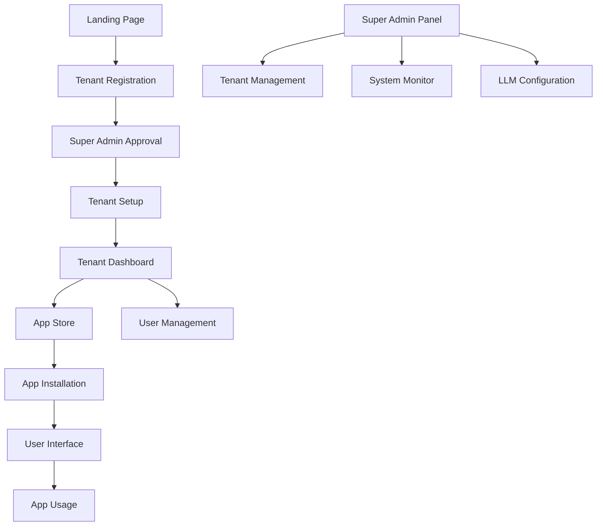

## 1. Product Overview
Hermes SaaS é uma plataforma multi-tenant de inteligência artificial que permite empresas gerenciarem e distribuírem serviços de IA para seus clientes. O sistema resolve o problema de centralização e gerenciamento de múltiplos modelos de IA em um único local, permitindo que empresas ofereçam serviços de IA white-label para seus clientes.

A plataforma é voltada para empresas B2B que desejam incorporar capacidades de IA em seus produtos sem desenvolver infraestrutura própria, oferecendo valor através de um sistema modular e escalável com roteamento inteligente entre diferentes modelos de LLM.

## 2. Core Features

### 2.1 User Roles
| Role | Registration Method | Core Permissions |
|------|---------------------|------------------|
| Super Admin | Convite interno | Gerenciar tenants, configurar sistema global, acessar logs |
| Tenant Admin | Registro por convite | Gerenciar usuários do tenant, configurar apps, ver analytics |
| Tenant User | Convite do Tenant Admin | Usar apps disponíveis, acessar histórico pessoal |
| End User | Registro público via tenant | Usar funcionalidades públicas dos apps |

### 2.2 Feature Module
O sistema Hermes SaaS consiste nos seguintes módulos principais:
1. **Portal do Tenant**: dashboard administrativo, gerenciamento de usuários, configuração de apps
2. **App Store**: catálogo de aplicativos de IA, instalação e configuração de módulos
3. **Interface de Usuário**: acesso aos apps instalados, histórico de uso, preferências
4. **Super Admin Panel**: gerenciamento global de tenants, monitoramento do sistema, configurações de LLM

### 2.3 Page Details
| Page Name | Module Name | Feature description |
|-----------|-------------|---------------------|
| Landing Page | Hero Section | Apresentar valor da plataforma, call-to-action para registro de tenants |
| Landing Page | Features Grid | Destacar principais funcionalidades: multi-tenant, PWA, LLM routing |
| Landing Page | Tenant Registration | Formulário de solicitação de conta com validação de domínio |
| Tenant Dashboard | Analytics Overview | Exibir métricas de uso: chamadas de API, usuários ativos, apps instalados |
| Tenant Dashboard | App Management | Listar apps instalados, botão para adicionar novos apps da store |
| Tenant Dashboard | User Management | Tabela de usuários do tenant, convidar novos usuários por email |
| App Store | App Catalog | Grid de apps disponíveis com filtros por categoria e busca |
| App Store | App Details | Página individual do app com descrição, screenshots, botão instalar |
| User Interface | App Launcher | Grid de apps instalados com acesso direto |
| User Interface | App Canvas | Interface do app selecionado com chat/voz/imagem conforme tipo |
| User Interface | History Panel | Histórico de interações com os apps, filtros por data e app |
| Super Admin | Tenant Management | Lista de todos tenants, status, planos, ações de gerenciamento |
| Super Admin | System Monitor | Dashboard de saúde do sistema, uso de recursos, logs de erro |
| Super Admin | LLM Configuration | Configurar chaves da OpenRouter, gerenciar uso do DeepSeek, políticas de roteamento |
| Authentication | Login Page | Login universal com redirecionamento baseado no domínio |
| Authentication | Tenant Setup | Configuração inicial do tenant após aprovação |
| PWA Interface | Offline Support | Interface funcional offline com sincronização quando online |
| PWA Interface | Push Notifications | Notificações de atividades importantes e atualizações |

## 3. Core Process

### Fluxo do Tenant
O tenant acessa a landing page, solicita uma conta preenchendo o formulário com informações da empresa. Após aprovação do super admin, recebe email com link para configurar o tenant. O tenant admin pode então convidar usuários e instalar apps da store. Os usuários do tenant acessam os apps através de um subdomain personalizado.

### Fluxo do Usuário Final
O usuário final acessa o subdomain do tenant, faz login e vê os apps disponíveis. Seleciona um app e interage através de interface específica (chat, voz ou upload de arquivos). O sistema roteia a requisição para a OpenRouter (utilizando o modelo DeepSeek primariamente) baseado em políticas configuradas. O histórico é salvo e sincronizado via PWA.

### Fluxo do Super Admin
O super admin acessa o painel administrativo global, monitora o sistema, gerencia tenants e configura os serviços de LLM. Pode ver analytics agregados, ajustar quotas de uso e gerenciar a app store global.

## 4. User Interface Design

### 4.1 Design Style
- **Cores Primárias**: Azul escuro (#1a1a2e) e roxo vibrante (#7b68ee)
- **Cores Secundárias**: Branco (#ffffff), cinza claro (#f8f9fa), verde de sucesso (#28a745)
- **Botões**: Estilo arredondado com sombra suave, hover effects gradient
- **Fontes**: Inter para headings, Roboto para body text, tamanhos 14-18px
- **Layout**: Card-based com navegação lateral, design limpo e minimalista
- **Ícones**: Feather Icons com stroke-width de 2px, consistência de 24px

### 4.2 Page Design Overview
| Page Name | Module Name | UI Elements |
|-----------|-------------|-------------|
| Landing Page | Hero Section | Background gradient animado, headline com animação typewriter, CTA button pulsante |
| Tenant Dashboard | Analytics Cards | Cards com métricas em tempo real, gráficos de linha/área, indicadores de tendência |
| App Store | App Grid | Cards responsivos 3-col, hover scale effect, badges de categoria, ratings |
| User Interface | Chat Interface | Mensagens com bubbles diferenciadas, typing indicator, input com auto-resize |
| Super Admin | Data Tables | Tabelas com sorting, filtering, pagination, actions dropdown, status badges |

### 4.3 Responsiveness
O produto segue abordagem desktop-first com adaptação completa para mobile. Breakpoints em 768px e 1024px. Touch otimizado com gestos de swipe para navegação entre apps e pinch-to-zoom para interfaces de imagem. PWA permite instalação como app nativo com splash screen personalizado.

### 4.4 3D Scene Guidance
Não aplicável - o sistema é focado em interfaces 2D com elementos de UI modernos.