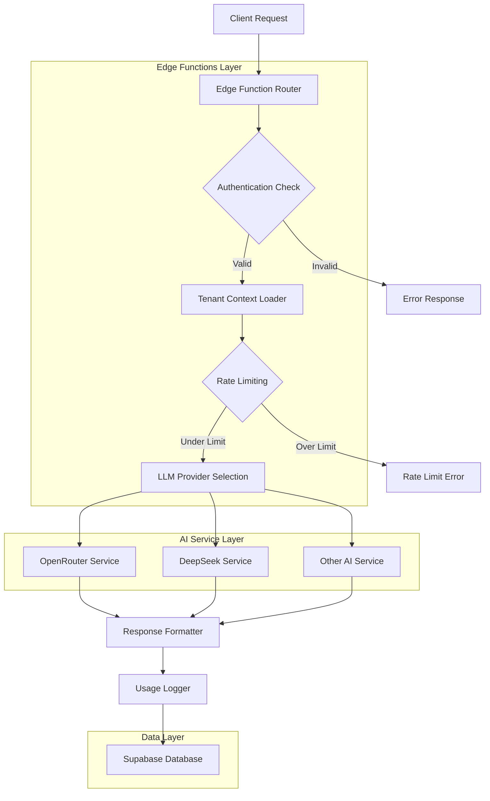
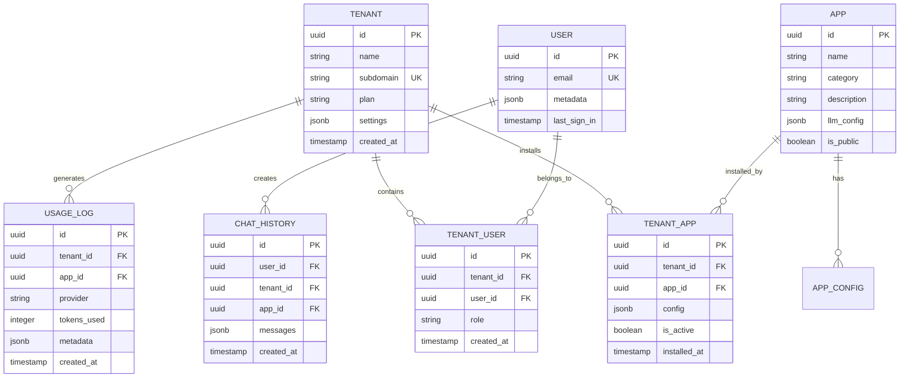

## 1. Architecture design

```mermaid
graph TD
    A[User Browser/PWA] --> B[React Frontend]
    B --> C[Supabase Client SDK]
    C --> D[Supabase Auth]
    C --> E[Supabase Database]
    C --> F[Supabase Storage]
    C --> G[Supabase Realtime]
    
    B --> H[Service Worker]
    H --> I[Offline Cache]
    
    B --> J[LLM Router Service]
    J --> K[OpenRouter API]
    J --> L[DeepSeek API (Direct/Fallback)]
    J --> M[Other LLM APIs]
    
    N[Super Admin] --> O[Admin Dashboard]
    O --> C
    
    subgraph "Frontend Layer"
        B
        H
        I
    end
    
    subgraph "Supabase Services"
        D
        E
        F
        G
    end
    
    subgraph "External AI Services"
        K
        L
        M
    end
```

## 2. Technology Description
- Frontend: React@18 + TypeScript + Vite
- UI Framework: TailwindCSS@3 + HeadlessUI
- State Management: Zustand + React Query
- PWA: Vite PWA Plugin + Workbox
- Backend: Supabase (BaaS completo)
- Database: PostgreSQL via Supabase
- Authentication: Supabase Auth (Magic Link + OAuth)
- Realtime: Supabase Realtime subscriptions
- Storage: Supabase Storage para arquivos
- LLM Integration: Edge Functions para roteamento
- Deployment: Vercel/Netlify (frontend) + Supabase (backend)

## 3. Route definitions
| Route | Purpose |
|-------|---------|
| / | Landing page principal |
| /auth/login | Login universal com detecção de tenant |
| /auth/callback | Callback de autenticação OAuth |
| /dashboard | Dashboard do tenant admin |
| /dashboard/users | Gerenciamento de usuários do tenant |
| /dashboard/analytics | Analytics do tenant |
| /apps | Lista de apps instalados |
| /apps/store | App store com catálogo |
| /apps/[appId] | Interface do app específico |
| /apps/[appId]/chat | Chat interface para apps de conversação |
| /apps/[appId]/generate | Interface de geração para apps criativos |
| /settings | Configurações do tenant |
| /profile | Perfil do usuário |
| /admin | Super admin dashboard |
| /admin/tenants | Gerenciamento de tenants |
| /admin/system | Monitoramento do sistema |
| /admin/llm-config | Configuração de LLMs |
| /offline | Página offline do PWA |

## 4. API definitions

### 4.1 Authentication APIs
```
POST /auth/v1/token
```
Request:
```json
{
  "email": "user@tenant.com",
  "password": "secure_password"
}
```

### 4.2 Tenant Management APIs
```
GET /rest/v1/tenants?id=eq.{tenant_id}
```
Response:
```json
{
  "id": "uuid",
  "name": "Tenant Name",
  "subdomain": "tenant",
  "plan": "premium",
  "settings": {}
}
```

### 4.3 App Store APIs
```
GET /rest/v1/apps?select=*&category=eq.productivity
```
Response:
```json
[
  {
    "id": "uuid",
    "name": "AI Assistant",
    "description": "Chat assistant powered by GPT",
    "category": "productivity",
    "llm_config": {
      "provider": "openrouter",
      "model": "deepseek/deepseek-chat"
    }
  }
]
```

### 4.4 LLM Router API (Edge Function)
```
POST /functions/v1/llm-router
```
Request:
```json
{
  "tenant_id": "uuid",
  "app_id": "uuid",
  "messages": [
    {"role": "user", "content": "Hello"}
  ],
  "config": {
    "temperature": 0.7,
    "max_tokens": 1000
  }
}
```

## 5. Server architecture diagram



## 6. Data model

### 6.1 Data model definition


### 6.2 Data Definition Language

```sql
-- Tenants table
CREATE TABLE tenants (
    id UUID PRIMARY KEY DEFAULT gen_random_uuid(),
    name VARCHAR(255) NOT NULL,
    subdomain VARCHAR(100) UNIQUE NOT NULL,
    plan VARCHAR(50) DEFAULT 'free' CHECK (plan IN ('free', 'starter', 'pro', 'enterprise')),
    settings JSONB DEFAULT '{}',
    created_at TIMESTAMP WITH TIME ZONE DEFAULT NOW(),
    updated_at TIMESTAMP WITH TIME ZONE DEFAULT NOW()
);

-- Users table (managed by Supabase Auth)
CREATE TABLE users (
    id UUID PRIMARY KEY,
    email VARCHAR(255) UNIQUE NOT NULL,
    metadata JSONB DEFAULT '{}',
    last_sign_in TIMESTAMP WITH TIME ZONE,
    created_at TIMESTAMP WITH TIME ZONE DEFAULT NOW()
);

-- Tenant users relationship
CREATE TABLE tenant_users (
    id UUID PRIMARY KEY DEFAULT gen_random_uuid(),
    tenant_id UUID REFERENCES tenants(id) ON DELETE CASCADE,
    user_id UUID REFERENCES users(id) ON DELETE CASCADE,
    role VARCHAR(50) DEFAULT 'member' CHECK (role IN ('admin', 'member')),
    created_at TIMESTAMP WITH TIME ZONE DEFAULT NOW(),
    UNIQUE(tenant_id, user_id)
);

-- Apps catalog
CREATE TABLE apps (
    id UUID PRIMARY KEY DEFAULT gen_random_uuid(),
    name VARCHAR(255) NOT NULL,
    slug VARCHAR(100) UNIQUE NOT NULL,
    category VARCHAR(100) NOT NULL,
    description TEXT,
    icon_url VARCHAR(500),
    llm_config JSONB DEFAULT '{}',
    is_public BOOLEAN DEFAULT true,
    created_at TIMESTAMP WITH TIME ZONE DEFAULT NOW()
);

-- Tenant app installations
CREATE TABLE tenant_apps (
    id UUID PRIMARY KEY DEFAULT gen_random_uuid(),
    tenant_id UUID REFERENCES tenants(id) ON DELETE CASCADE,
    app_id UUID REFERENCES apps(id) ON DELETE CASCADE,
    config JSONB DEFAULT '{}',
    is_active BOOLEAN DEFAULT true,
    installed_at TIMESTAMP WITH TIME ZONE DEFAULT NOW(),
    UNIQUE(tenant_id, app_id)
);

-- Chat history
CREATE TABLE chat_history (
    id UUID PRIMARY KEY DEFAULT gen_random_uuid(),
    user_id UUID REFERENCES users(id) ON DELETE CASCADE,
    tenant_id UUID REFERENCES tenants(id) ON DELETE CASCADE,
    app_id UUID REFERENCES apps(id) ON DELETE CASCADE,
    session_id VARCHAR(255),
    messages JSONB DEFAULT '[]',
    metadata JSONB DEFAULT '{}',
    created_at TIMESTAMP WITH TIME ZONE DEFAULT NOW()
);

-- Usage logs for billing
CREATE TABLE usage_logs (
    id UUID PRIMARY KEY DEFAULT gen_random_uuid(),
    tenant_id UUID REFERENCES tenants(id) ON DELETE CASCADE,
    app_id UUID REFERENCES apps(id) ON DELETE CASCADE,
    user_id UUID REFERENCES users(id) ON DELETE CASCADE,
    provider VARCHAR(100) NOT NULL,
    model VARCHAR(100) NOT NULL,
    tokens_input INTEGER DEFAULT 0,
    tokens_output INTEGER DEFAULT 0,
    cost_usd DECIMAL(10,6) DEFAULT 0,
    metadata JSONB DEFAULT '{}',
    created_at TIMESTAMP WITH TIME ZONE DEFAULT NOW()
);

-- Indexes for performance
CREATE INDEX idx_tenant_users_tenant_id ON tenant_users(tenant_id);
CREATE INDEX idx_tenant_users_user_id ON tenant_users(user_id);
CREATE INDEX idx_tenant_apps_tenant_id ON tenant_apps(tenant_id);
CREATE INDEX idx_chat_history_user_tenant ON chat_history(user_id, tenant_id);
CREATE INDEX idx_chat_history_created_at ON chat_history(created_at DESC);
CREATE INDEX idx_usage_logs_tenant_date ON usage_logs(tenant_id, created_at DESC);
CREATE INDEX idx_usage_logs_created_at ON usage_logs(created_at DESC);

-- Row Level Security (RLS) policies
ALTER TABLE tenants ENABLE ROW LEVEL SECURITY;
ALTER TABLE tenant_users ENABLE ROW LEVEL SECURITY;
ALTER TABLE tenant_apps ENABLE ROW LEVEL SECURITY;
ALTER TABLE chat_history ENABLE ROW LEVEL SECURITY;
ALTER TABLE usage_logs ENABLE ROW LEVEL SECURITY;

-- Basic RLS policies
CREATE POLICY "Users can view their tenant" ON tenants FOR SELECT USING (
    EXISTS (
        SELECT 1 FROM tenant_users 
        WHERE tenant_users.tenant_id = tenants.id 
        AND tenant_users.user_id = auth.uid()
    )
);

CREATE POLICY "Users can view their tenant users" ON tenant_users FOR SELECT USING (
    tenant_id IN (
        SELECT tenant_id FROM tenant_users 
        WHERE user_id = auth.uid()
    )
);

-- Grant permissions
GRANT SELECT ON tenants TO anon;
GRANT ALL ON tenants TO authenticated;
GRANT SELECT ON tenant_users TO authenticated;
GRANT ALL ON tenant_users TO authenticated;
GRANT SELECT ON apps TO anon;
GRANT SELECT ON tenant_apps TO authenticated;
GRANT ALL ON tenant_apps TO authenticated;
GRANT SELECT ON chat_history TO authenticated;
GRANT ALL ON chat_history TO authenticated;
GRANT SELECT ON usage_logs TO authenticated;
```